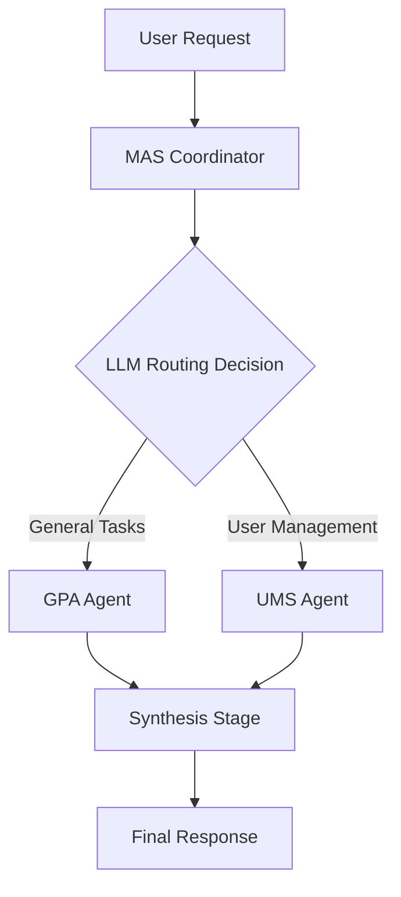

# MAS Coordinator Documentation

Welcome to the **Multi-Agent System (MAS) Coordinator** documentation. This project implements an intelligent routing system that delegates user requests to specialized AI agents within the DIAL ecosystem.

## Overview

The MAS Coordinator acts as a **smart router** that:
1. **Analyzes** user intent using an LLM
2. **Routes** requests to the appropriate specialized agent:
   - **GPA (General-Purpose Agent)**: Web search, RAG, code execution, image generation
   - **UMS Agent**: User management operations
3. **Synthesizes** agent responses into polished user-friendly output



## Key Features

- ✅ **Intelligent Routing**: LLM-based agent selection with structured JSON output
- ✅ **Stage Propagation**: Real-time UI updates showing agent progress
- ✅ **State Management**: Conversation continuity across multi-turn interactions
- ✅ **Attachment Forwarding**: Seamless handling of images, PDFs, and generated files
- ✅ **DIAL-Compatible**: Full integration with DIAL SDK and ecosystem

## Quick Navigation

### Getting Started
- [Setup Guide](setup.md) - Installation and configuration
- [Architecture Overview](architecture.md) - System design and data flow
- [API Reference](api.md) - Endpoints and interfaces

### Development
- [Testing Guide](testing.md) - Test strategy and execution
- [ADR Index](adr/README.md) - Architecture decision records

### Reference
- [Glossary](glossary.md) - Domain terminology
- [Roadmap](roadmap.md) - Future enhancements

## Quick Start

```bash
# 1. Set environment variable
export DIAL_API_KEY=your_api_key_here

# 2. Start infrastructure
docker-compose up -d

# 3. Create Python environment
python3 -m venv dial_mas_coordinator
source dial_mas_coordinator/bin/activate
pip install -r requirements.txt

# 4. Run coordinator
python -m uvicorn task.app:app --port 8055 --host 0.0.0.0
```

**Test endpoint:**
```bash
curl -X POST http://localhost:8055/openai/deployments/mas-coordinator/chat/completions \
  -H "Content-Type: application/json" \
  -H "Api-Key: dial_api_key" \
  -d '{"messages": [{"role": "user", "content": "What is the weather in Paris?"}]}'
```

## Architecture at a Glance

The coordinator operates in **three stages**:

1. **Coordination Stage**: LLM determines which agent to route to
2. **Agent Stage**: Delegated agent processes request with full DIAL features
3. **Synthesis Stage**: LLM creates final user-friendly response

See [architecture.md](architecture.md) for detailed design.

## Technology Stack

| Layer | Technology |
|-------|-----------|
| Framework | FastAPI (via DIAL SDK) |
| LLM Client | aidial-client, AsyncDial |
| Data Validation | Pydantic 2.x |
| Deployment | Docker Compose, Uvicorn |
| State Storage | Redis |
| API Gateway | DIAL Core |

## Project Structure

```
task/                      # Main application code
├── app.py                # DIAL application entry point
├── agent.py              # MASCoordinator orchestration logic
├── models.py             # Pydantic data models
├── prompts.py            # System prompts for LLM calls
├── stage_util.py         # Stage management utilities
├── logging_config.py     # Logging configuration
└── coordination/         # Agent gateway implementations
    ├── gpa.py           # GPA gateway with stage propagation
    └── ums_agent.py     # UMS agent gateway with conversation tracking

core/                     # DIAL Core configuration
settings/                 # DIAL Core settings
docker-compose.yml        # Multi-service orchestration
```

## Contributing

When contributing to this project:
1. Review [Architecture Decision Records](adr/README.md)
2. Follow DIAL SDK patterns for ChatCompletion handlers
3. Ensure proper state management for conversation continuity
4. Add tests for new routing logic or gateway implementations

## Support and Resources

- **DIAL SDK Documentation**: [GitHub - epam/ai-dial-sdk](https://github.com/epam/ai-dial-sdk)
- **Issue Tracker**: TODO: Add issue tracker link
- **Team Contact**: TODO: Add team contact information

## License

TODO: Add license information

---

**Next Steps**: Explore the [Architecture](architecture.md) or jump into [Setup](setup.md) to get started.
