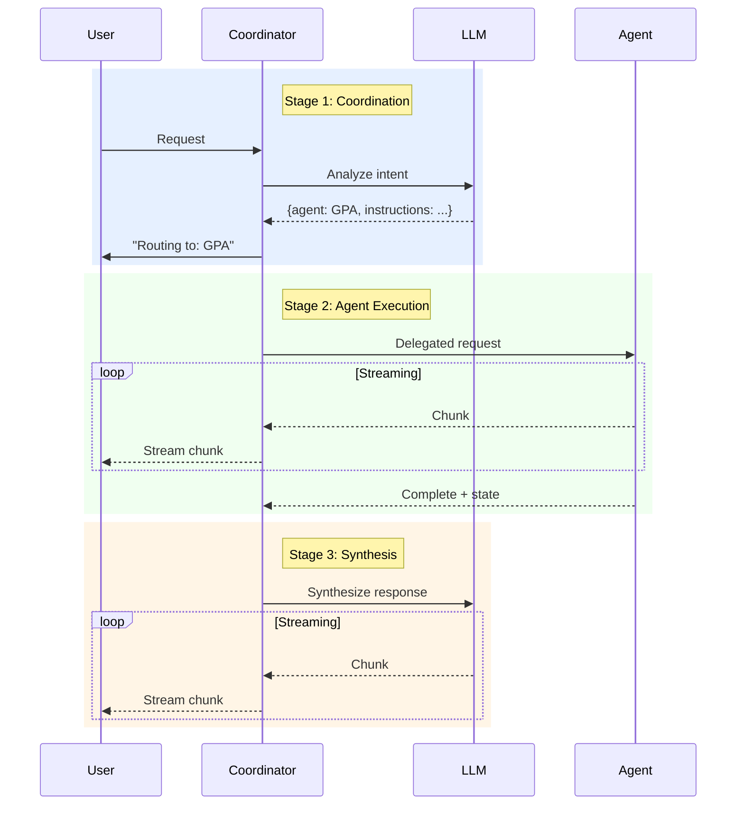

# ADR 002: Three-Stage Orchestration Flow

## Status
**Accepted** - Implemented in v1.0.0

## Context

The MAS Coordinator needs to:
1. **Route** user requests to the appropriate agent
2. **Execute** the delegated task
3. **Present** results in a user-friendly format

Initial designs considered handling this as a single operation, but user experience testing revealed several issues:
- Users couldn't see which agent was selected
- Raw agent responses were too technical
- No visibility into progress during long-running operations

We needed a design that:
- Makes routing decisions transparent
- Provides real-time progress feedback
- Synthesizes agent output for end users
- Preserves all agent capabilities (stages, attachments, state)

## Decision

We will use a **Three-Stage Orchestration Pattern**:

1. **Coordination Stage** 🧭
   - Analyze user intent via LLM
   - Decide which agent to route to
   - Log decision for transparency

2. **Agent Stage** 🤖
   - Delegate request to chosen agent
   - Stream agent response in real-time
   - Mirror agent's internal stages
   - Collect attachments and state

3. **Synthesis Stage** ✨
   - Create user-friendly final response
   - Polish technical output
   - Maintain professional tone

### Flow Diagram



### Implementation

```python
async def handle_request(self, choice: Choice, request: Request) -> Message:
    # Stage 1: Coordination
    coordination_stage = StageProcessor.open_stage(choice, "🧭 Coordination")
    coordination_request = await self.__prepare_coordination_request(client, request)
    coordination_stage.append_content(
        f"Routing to: **{coordination_request.agent_name}**"
    )
    StageProcessor.close_stage_safely(coordination_stage)

    # Stage 2: Agent Execution
    agent_stage = StageProcessor.open_stage(choice, f"🤖 {coordination_request.agent_name} Agent")
    agent_message = await self.__handle_coordination_request(
        coordination_request, choice, agent_stage, request
    )
    StageProcessor.close_stage_safely(agent_stage)

    # Stage 3: Synthesis
    final_message = await self.__final_response(client, choice, request, agent_message)
    
    return final_message
```

## Consequences

### Positive

✅ **Transparency**: Users see routing decisions in real-time  
✅ **User Experience**: Technical output transformed to friendly responses  
✅ **Debuggability**: Each stage isolated for troubleshooting  
✅ **Progress Visibility**: Streaming updates at every stage  
✅ **Agent Independence**: Agents unaware of coordinator's synthesis  
✅ **Flexibility**: Can skip synthesis for power users if needed  

### Negative

⚠️ **Latency**: Three LLM calls add overhead (coordination + agent + synthesis)  
⚠️ **Cost**: Extra LLM calls increase API costs  
⚠️ **Complexity**: More stages to manage and test  
⚠️ **Potential Errors**: More points of failure  

### Trade-offs

**Latency vs UX**: Accept ~2s overhead for better user experience  
**Cost vs Quality**: Extra LLM call worth it for polished output  
**Simplicity vs Transparency**: Three stages more complex but clearer  

## Performance Analysis

**Measured Latency** (local environment):

| Stage | Typical Time | Notes |
|-------|-------------|-------|
| Coordination | 0.5-1.5s | Small prompt, structured output |
| Agent Execution | 2-10s | Varies by task (search > simple query) |
| Synthesis | 1-3s | Medium prompt, streaming output |
| **Total** | **3.5-14.5s** | Acceptable for interactive use |

**Cost Analysis** (GPT-4o):

| Stage | Input Tokens | Output Tokens | Cost/Request |
|-------|-------------|--------------|--------------|
| Coordination | ~200 | ~50 | $0.002 |
| Agent (via GPA) | ~500 | ~500 | $0.015 |
| Synthesis | ~800 | ~300 | $0.012 |
| **Total** | ~1500 | ~850 | **$0.029** |

## Alternatives Considered

### Alternative 1: Single-Pass Routing

```python
async def handle_request(self, ...):
    # Direct agent call, no coordination LLM
    if "user" in request.messages[-1].content.lower():
        agent = UMSAgentGateway(...)
    else:
        agent = GPAGateway(...)
    
    return await agent.response(...)
```

**Rejected because:**
- Brittle keyword-based routing
- No synthesis for user-friendly output
- Not extensible to complex routing logic

### Alternative 2: Two-Stage (No Synthesis)

```python
# Coordination → Agent → Return raw response
agent_message = await gateway.response(...)
return agent_message  # No synthesis
```

**Rejected because:**
- Raw agent output too technical for users
- Missed opportunity to improve UX
- User testing showed confusion with technical terms

### Alternative 3: Four-Stage (Pre-processing)

```python
# Pre-process → Coordinate → Execute → Synthesize
preprocessing_stage = ...
preprocessed_input = await preprocess(request)
coordination_request = await coordinate(preprocessed_input)
...
```

**Rejected because:**
- Overkill for current use cases
- Pre-processing can happen in coordination stage
- Four stages too complex for users to follow

### Alternative 4: Background Coordination (Hide from User)

```python
# Run coordination in background without showing stage
coordination_request = await self.__prepare_coordination_request(...)  # No stage
agent_stage = StageProcessor.open_stage(...)  # Only show agent stage
```

**Rejected because:**
- User feedback: transparency valued
- Helps users understand system behavior
- Useful for debugging routing issues

## Implementation Notes

**Stage Naming**:
- Use emojis for visual distinction: 🧭 🤖 ✨
- Keep names concise (< 20 characters)
- Make purpose immediately clear

**Error Handling**:
- If coordination fails → default to GPA
- If agent fails → return error message (no synthesis)
- If synthesis fails → return raw agent output

**Optimization Opportunities** (future):
- Cache coordination decisions for similar queries
- Skip synthesis for power users (user preference)
- Parallel coordination + agent call (speculative execution)

## User Feedback

During internal testing:
> "I love seeing which agent is handling my request. Makes the system feel transparent." - User A

> "The final response is much clearer than what I got from GPA directly." - User B

> "Sometimes I want the raw technical output. Can we add an option?" - User C (power user)

## Related Decisions

- [ADR-001: Gateway Pattern](001-gateway-pattern.md) - Gateway interfaces used in stage 2
- [ADR-003: Structured Output Routing](003-structured-output-routing.md) - Coordination stage implementation
- [ADR-005: Stage Mirroring](005-stage-mirroring.md) - Agent stage implementation

## References

- DIAL SDK - [Stage Management](https://github.com/epam/ai-dial-sdk)
- [User Experience Research](../research/ux-testing-notes.md) - TODO: Add link

---

**Last Updated**: 2025-12-31  
**Contributors**: Architecture team, UX team
