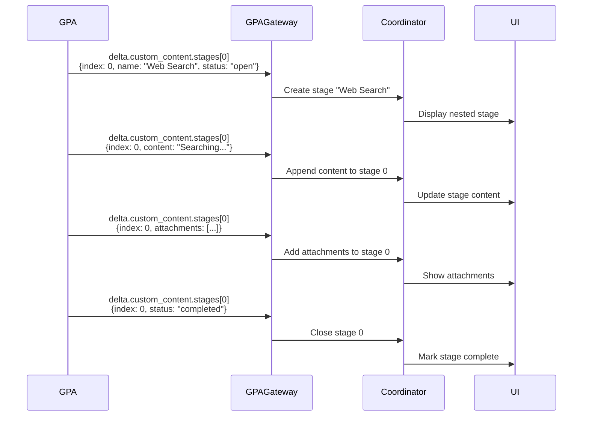

# ADR 005: Stage Mirroring for UI Feedback

## Status
**Accepted** - Implemented in v1.0.0

## Context

GPA agent performs complex multi-step operations:
- Web search with DuckDuckGo
- Python code execution
- RAG search through documents
- Image generation with DALL-E

Each operation opens its own stage in the GPA response for progress visibility. Example GPA stages:
- "🔍 Web Search"
- "🐍 Python Code Execution"
- "📄 Document Analysis"
- "🎨 Image Generation"

**Problem**: When GPA streams these stages, the coordinator receives them in `delta.custom_content.stages`, but **users can't see them** because they're nested inside the coordinator's "🤖 GPA Agent" stage.

**User Experience Issue:**
```
✅ 🧭 Coordination (closed)
└─ Routing to: GPA

🔄 🤖 GPA Agent (open)
└─ [GPA executing web search internally, user sees nothing]
```

**Desired Experience:**
```
✅ 🧭 Coordination (closed)
└─ Routing to: GPA

🔄 🤖 GPA Agent (open)
  ├─ ✅ 🔍 Web Search (closed)
  │  └─ Searching: "weather in Paris"
  ├─ 🔄 🐍 Python Code Execution (open)
  │  └─ Running: temperature_converter(...)
```

We needed a way to propagate GPA's internal stages to the coordinator's response so users see real-time progress.

## Decision

Implement **Stage Mirroring**: Create coordinator stages that mirror GPA's internal stages by tracking and replicating stage lifecycle events.

### Architecture



### Implementation

**Data Structure:**
```python
stages_map: dict[int, Stage] = {}  # Track mirrored stages by GPA's index
```

**Mirroring Logic** ([task/coordination/gpa.py](../../task/coordination/gpa.py#L90-L115)):
```python
async for chunk in stream:
    if delta.custom_content:
        cc_dict = delta.custom_content.dict(exclude_none=True)
        
        if 'stages' in cc_dict:
            for stg in cc_dict['stages']:
                idx = stg.get('index')
                if idx is None:
                    continue
                
                if idx in stages_map:
                    # Update existing mirrored stage
                    mirrored_stage = stages_map[idx]
                    
                    if 'content' in stg:
                        mirrored_stage.append_content(stg['content'])
                    
                    if 'attachments' in stg:
                        for att_dict in stg['attachments']:
                            mirrored_stage.add_attachment(**att_dict)
                    
                    if stg.get('status') == 'completed':
                        StageProcessor.close_stage_safely(mirrored_stage)
                else:
                    # Open new mirrored stage
                    stage_name = stg.get('name', f'GPA Stage {idx}')
                    new_stage = StageProcessor.open_stage(choice, stage_name)
                    stages_map[idx] = new_stage
                    
                    # Apply initial content if present
                    if 'content' in stg:
                        new_stage.append_content(stg['content'])
```

### Stage Index Tracking

GPA assigns each stage a unique **index** (0, 1, 2, ...). We use this index as the key to track which coordinator stage corresponds to which GPA stage.

**Why index instead of name?**
- Names can be duplicated ("Web Search" might appear twice)
- Index is guaranteed unique per response
- GPA controls index assignment

## Consequences

### Positive

✅ **User Visibility**: Users see GPA's internal operations in real-time  
✅ **Transparency**: Complex operations (search, code execution) no longer black boxes  
✅ **Debugging**: Easier to identify which step failed  
✅ **Progress Feedback**: Long-running operations show intermediate progress  
✅ **Professional UX**: Nested stages create hierarchical progress view  

### Negative

⚠️ **Complexity**: Stage tracking adds ~50 lines of logic  
⚠️ **Coupling**: Coordinator depends on GPA's stage format  
⚠️ **Memory**: Must track all open stages in dictionary  
⚠️ **Error Handling**: Stage close failures require safe handling  

### Trade-offs

**Complexity vs UX**: Accept complexity for better user experience  
**Coupling vs Isolation**: Weak coupling acceptable (only reads stage data)

## Performance Impact

**Memory**: ~200 bytes per mirrored stage  
**Latency**: Negligible (~1ms per stage operation)  
**Cost**: No impact on LLM API calls

## Stage Lifecycle

### 1. Stage Open
**From GPA:**
```json
{
  "custom_content": {
    "stages": [{
      "index": 0,
      "name": "🔍 Web Search",
      "status": "open"
    }]
  }
}
```

**Coordinator Action:**
```python
new_stage = StageProcessor.open_stage(choice, "🔍 Web Search")
stages_map[0] = new_stage
```

### 2. Content Append
**From GPA:**
```json
{
  "custom_content": {
    "stages": [{
      "index": 0,
      "content": "Searching: 'weather in Paris'"
    }]
  }
}
```

**Coordinator Action:**
```python
mirrored_stage = stages_map[0]
mirrored_stage.append_content("Searching: 'weather in Paris'")
```

### 3. Attachments
**From GPA:**
```json
{
  "custom_content": {
    "stages": [{
      "index": 0,
      "attachments": [{
        "type": "text/plain",
        "title": "search_results.txt",
        "data": "..."
      }]
    }]
  }
}
```

**Coordinator Action:**
```python
mirrored_stage = stages_map[0]
mirrored_stage.add_attachment(
    type="text/plain",
    title="search_results.txt",
    data="..."
)
```

### 4. Stage Close
**From GPA:**
```json
{
  "custom_content": {
    "stages": [{
      "index": 0,
      "status": "completed"
    }]
  }
}
```

**Coordinator Action:**
```python
mirrored_stage = stages_map[0]
StageProcessor.close_stage_safely(mirrored_stage)
```

## Edge Cases

### Case 1: Out-of-Order Stage Updates

GPA might send updates non-sequentially:
```
index: 0 → open
index: 1 → open
index: 0 → content
index: 1 → content
index: 0 → close
index: 1 → close
```

**Handled**: Dictionary lookup allows updates in any order.

### Case 2: Duplicate Index

GPA should never reuse indices, but if it does:
```
index: 0 → open (creates new stage)
index: 0 → open (ERROR: tries to open again)
```

**Handled**: `if idx in stages_map` check prevents duplicate creation.

### Case 3: Close Non-Existent Stage

```
index: 5 → close (never opened)
```

**Handled**: `if idx in stages_map` check skips the close operation.

### Case 4: Stage Never Closed

GPA crashes or stops streaming before closing a stage.

**Handled**: DIAL SDK auto-closes all stages when response completes.

## UMS Agent Stages

**UMS agent does NOT use internal stages** - it's a simpler agent without multi-step operations.

Therefore, **no stage mirroring needed for UMS**. The coordinator's "🤖 UMS Agent" stage is sufficient.

## Future Enhancements

### Selective Stage Mirroring

Some users may not want nested stages (too much detail).

**User Preference:**
```python
if user_preferences.show_nested_stages:
    # Mirror stages
else:
    # Only show parent "GPA Agent" stage
```

### Stage Filtering

Mirror only specific stage types:
```python
ALLOWED_STAGES = ["Web Search", "Python Code Execution"]

if stg.get('name') in ALLOWED_STAGES:
    # Mirror this stage
else:
    # Append content to parent stage instead
```

### Stage Depth Limit

Prevent excessive nesting:
```python
MAX_NESTED_DEPTH = 2

if len(stages_map) < MAX_NESTED_DEPTH:
    # Create nested stage
else:
    # Append to deepest stage
```

## Alternatives Considered

### Alternative 1: Flatten All Stages

Show GPA stages as siblings to coordinator stages:
```
✅ 🧭 Coordination
✅ 🔍 Web Search (from GPA)
✅ 🐍 Python Execution (from GPA)
🔄 🤖 GPA Agent
```

**Rejected because:**
- Confusing hierarchy (are these coordinator or GPA stages?)
- Loses logical grouping under GPA agent
- Harder to understand which agent is performing which operation

### Alternative 2: Log-Style Output

Instead of nested stages, append stage updates to parent stage content:
```
🔄 🤖 GPA Agent
└─ [12:00:01] Starting web search...
   [12:00:03] Search completed
   [12:00:04] Executing Python code...
```

**Rejected because:**
- Less interactive (no collapsible stages)
- Mixes content with status updates
- Can't show attachments per sub-operation

### Alternative 3: Ignore GPA Stages

Don't mirror - just show parent stage:
```
🔄 🤖 GPA Agent
└─ [GPA processing your request...]
```

**Rejected because:**
- Poor user experience for long operations
- No progress visibility
- Defeats purpose of GPA's detailed stages

## Testing

**Unit Test:**
```python
def test_stage_mirroring():
    stages_map = {}
    
    # Stage open
    stg_open = {"index": 0, "name": "Test Stage", "status": "open"}
    # ... create stage, add to stages_map[0]
    assert 0 in stages_map
    
    # Stage content
    stg_content = {"index": 0, "content": "Processing..."}
    # ... append content to stages_map[0]
    
    # Stage close
    stg_close = {"index": 0, "status": "completed"}
    # ... close stages_map[0]
```

**Integration Test:**
```python
async def test_gpa_stage_propagation():
    # Call GPA via coordinator
    response = await coordinator.handle_request(choice, request)
    
    # Verify nested stages were created
    response_dict = choice.to_dict()
    stages = response_dict.get("custom_content", {}).get("stages", [])
    
    # Should have coordinator stages + mirrored GPA stages
    assert len(stages) >= 2  # At minimum: Coordination + GPA Agent
```

## Related Decisions

- [ADR-001: Gateway Pattern](001-gateway-pattern.md) - Gateway implements mirroring
- [ADR-002: Three-Stage Orchestration](002-three-stage-orchestration.md) - Agent stage contains mirrored stages

## References

- DIAL SDK - [Stage API](https://github.com/epam/ai-dial-sdk)
- [task/stage_util.py](../../task/stage_util.py) - Stage utilities
- [task/coordination/gpa.py](../../task/coordination/gpa.py#L90-L115) - Mirroring implementation

---

**Last Updated**: 2025-12-31  
**Contributors**: Architecture team, UX team
