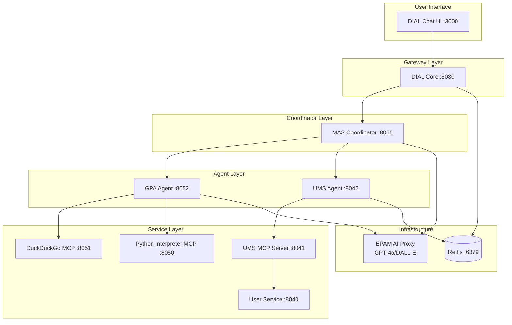
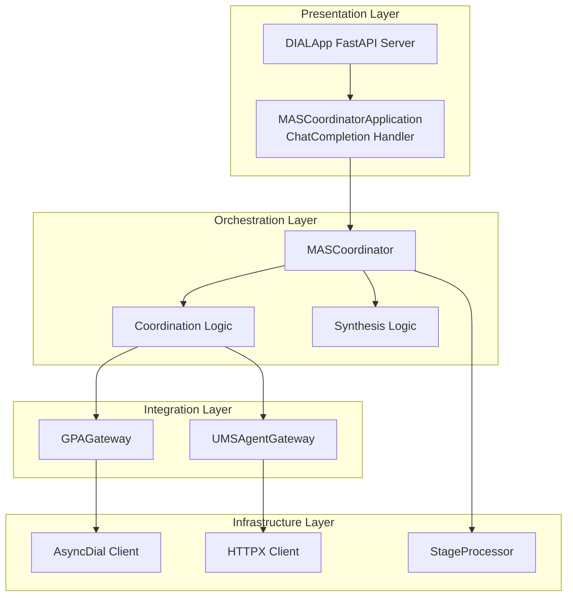
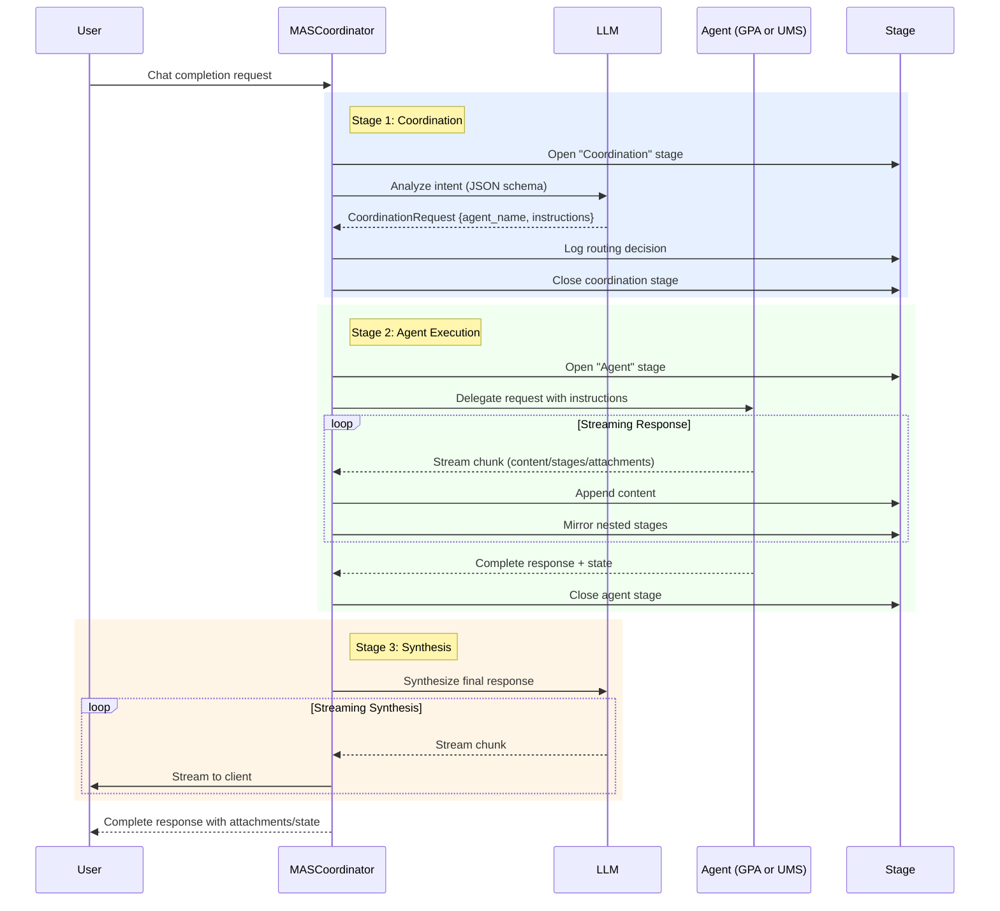
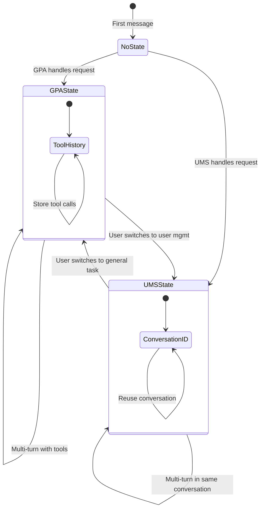
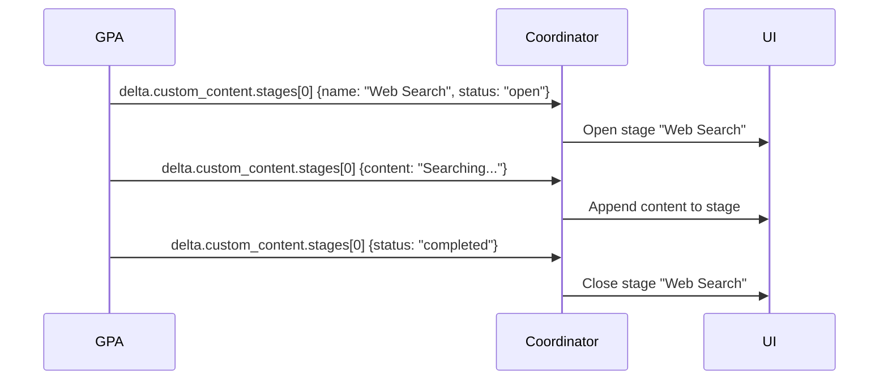
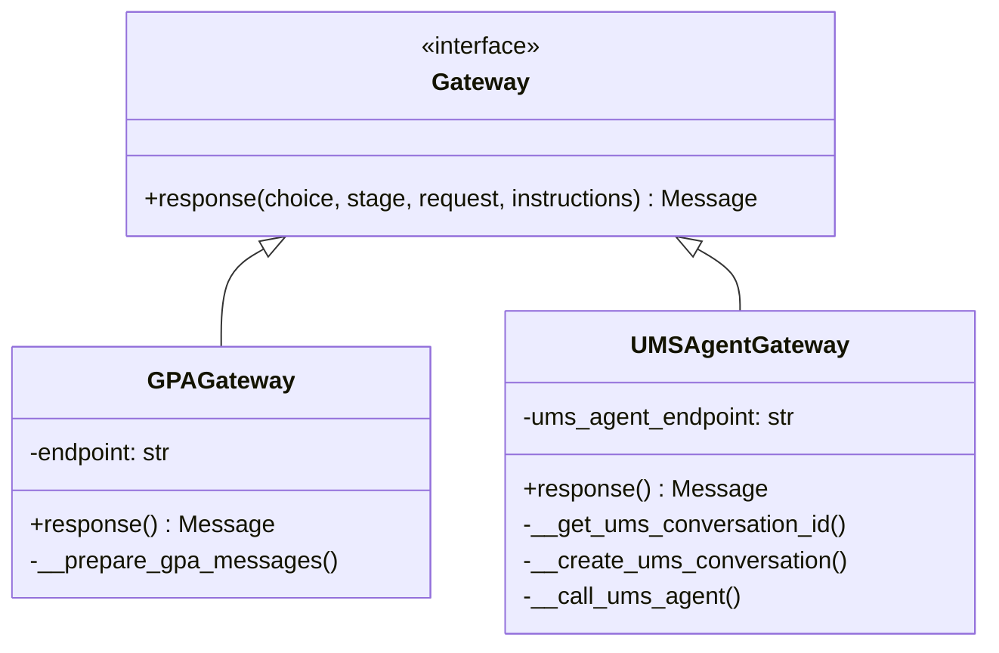
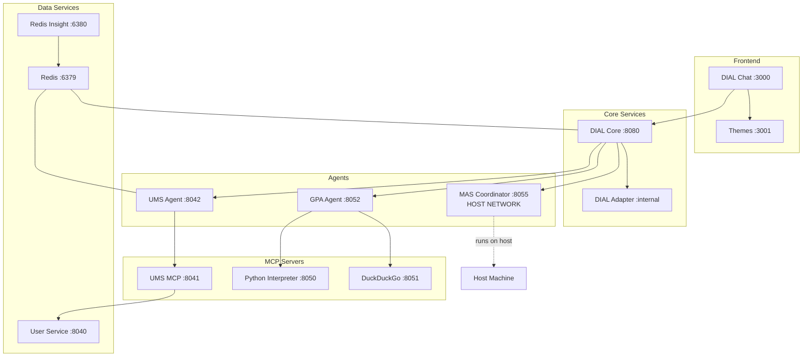

# MAS Coordinator Architecture

This document describes the architectural design of the Multi-Agent System (MAS) Coordinator, including system boundaries, component interactions, data flow, and key design decisions.

## Table of Contents
- [System Overview](#system-overview)
- [Component Architecture](#component-architecture)
- [Data Flow](#data-flow)
- [State Management](#state-management)
- [Stage Propagation](#stage-propagation)
- [Design Patterns](#design-patterns)
- [Deployment Architecture](#deployment-architecture)
- [Constraints and Limitations](#constraints-and-limitations)

## System Overview

The MAS Coordinator is a **routing layer** in the DIAL ecosystem that intelligently delegates user requests to specialized agents based on intent analysis.



### System Boundaries

**What the MAS Coordinator IS:**
- An intelligent router analyzing user intent
- A response synthesizer creating user-friendly output
- A state orchestrator managing conversation continuity

**What the MAS Coordinator IS NOT:**
- A tool executor (delegates to GPA)
- A user database (delegates to UMS)
- A general-purpose agent (uses specialized agents)

## Component Architecture

### Layer Architecture



### Module Responsibilities

| Module | File | Responsibility |
|--------|------|----------------|
| **Application** | [task/app.py](../task/app.py) | DIAL app initialization, endpoint registration |
| **Coordinator** | [task/agent.py](../task/agent.py) | Request orchestration, routing, synthesis |
| **GPA Gateway** | [task/coordination/gpa.py](../task/coordination/gpa.py) | GPA communication, stage propagation |
| **UMS Gateway** | [task/coordination/ums_agent.py](../task/coordination/ums_agent.py) | UMS conversation management |
| **Models** | [task/models.py](../task/models.py) | Pydantic data schemas |
| **Prompts** | [task/prompts.py](../task/prompts.py) | LLM system prompts |
| **Stage Utils** | [task/stage_util.py](../task/stage_util.py) | Stage lifecycle management |

## Data Flow

### Request Processing Sequence



### Message Flow Details

1. **Incoming Request** (User → Coordinator)
   - OpenAI-compatible chat completion format
   - Headers: `Api-Key`, `x-conversation-id`
   - Body: `{messages: [...], model: "mas-coordinator"}`

2. **Coordination Decision** (Coordinator → LLM)
   - System prompt: [COORDINATION_REQUEST_SYSTEM_PROMPT](../task/prompts.py)
   - Structured output: `CoordinationRequest` JSON schema
   - Response: `{agent_name: "GPA"|"UMS", additional_instructions: string?}`

3. **Agent Delegation** (Coordinator → Agent)
   - **GPA**: Filtered message history + tool state restoration
   - **UMS**: New or existing conversation ID + message augmentation

4. **Agent Response** (Agent → Coordinator)
   - **GPA**: Streaming with custom_content (stages, attachments, state)
   - **UMS**: SSE format with conversation_id

5. **Synthesis** (Coordinator → LLM → User)
   - System prompt: [FINAL_RESPONSE_SYSTEM_PROMPT](../task/prompts.py)
   - Context: Original request + agent response
   - Output: Polished, user-friendly response

## State Management

### Conversation State Patterns



### State Storage Strategy

**GPA State** ([coordination/gpa.py](../task/coordination/gpa.py)):
```python
{
    "is_gpa": True,
    "gpa_messages": {
        # GPA's internal tool call state
        # Restored on next GPA request
    }
}
```

**UMS State** ([coordination/ums_agent.py](../task/coordination/ums_agent.py)):
```python
{
    "ums_conversation_id": "uuid-string"
    # UMS agent maintains full history server-side
}
```

**Why Different Strategies?**
- **GPA**: Stateless service; requires tool call history for multi-turn
- **UMS**: Stateful service with conversation API; only needs conversation ID

## Stage Propagation

### The Stage Mirroring Pattern

Stages provide real-time UI feedback. GPA's internal stages must be mirrored to the coordinator's response.



**Implementation** ([coordination/gpa.py](../task/coordination/gpa.py#L90-L115)):
- Track stages by `index` in a `dict[int, Stage]`
- Open new stages on first appearance
- Append content to existing stages
- Close on `status: "completed"`

## Design Patterns

### 1. Gateway Pattern

**Purpose**: Isolate agent-specific communication logic



**Benefits**:
- Agent-specific concerns encapsulated
- Easy to add new agents (extend Gateway)
- Testable in isolation

### 2. Three-Stage Orchestration Pattern

**Coordination → Delegation → Synthesis**

Each stage has a clear responsibility:
1. **Coordination**: Decision-making (which agent?)
2. **Delegation**: Execution (call the agent)
3. **Synthesis**: Presentation (polish the output)

### 3. Structured Output with JSON Schema

Forces LLM responses into validated Pydantic models:

```python
extra_body={
    "response_format": {
        "type": "json_schema",
        "json_schema": {
            "name": "response",
            "schema": CoordinationRequest.model_json_schema()
        }
    }
}
```

**Benefits**:
- Type-safe routing decisions
- No parsing errors
- Self-documenting API

## Deployment Architecture

### Docker Compose Services



**Port Mapping:**
| Service | Internal Port | External Port | Network |
|---------|--------------|---------------|---------|
| MAS Coordinator | 8055 | 8055 | host.docker.internal |
| GPA Agent | 5000 | 8052 | Docker bridge |
| UMS Agent | 8000 | 8042 | Docker bridge |
| DIAL Core | 8080 | 8080 | Docker bridge |
| Redis | 6379 | 6379 | Docker bridge |

### Environment Variables

| Variable | Required | Default | Description |
|----------|----------|---------|-------------|
| `DIAL_API_KEY` | ✅ | - | EPAM AI Proxy API key |
| `DIAL_ENDPOINT` | ❌ | http://localhost:8080 | DIAL Core URL |
| `UMS_AGENT_ENDPOINT` | ❌ | http://localhost:8042 | UMS Agent URL |
| `DEPLOYMENT_NAME` | ❌ | gpt-4o | LLM model name |
| `LOG_LEVEL` | ❌ | INFO | Logging verbosity |

## Constraints and Limitations

### Technical Constraints

1. **Pydantic Version Mismatch**
   - `aidial_client` uses Pydantic v1-style models
   - `aidial_sdk` uses Pydantic v2
   - **Workaround**: Convert via `.dict(exclude_none=True)`

2. **Single-Choice Response**
   - Coordinator always returns one choice (no multi-choice support)

3. **Synchronous Agent Calls**
   - Agents called sequentially, not in parallel
   - Future: Could support multi-agent consultation

4. **State Size Limits**
   - Large tool call histories may exceed Redis limits
   - TODO: Implement state pruning strategy

### Operational Constraints

1. **LLM Dependency**
   - Three LLM calls per request (coordination + agent + synthesis)
   - Failure in routing stage = entire request fails

2. **Network Latency**
   - Coordinator → Agent → MCP → Service (multi-hop)
   - Affects time-to-first-token

3. **Conversation Isolation**
   - GPA and UMS maintain separate conversation contexts
   - No cross-agent context sharing

## Security Considerations

1. **API Key Management**
   - ⚠️ **CRITICAL**: Remove keys from [core/config.json](../core/config.json) before commit
   - Use environment variables for all secrets

2. **Input Validation**
   - Pydantic models validate LLM outputs
   - DIAL SDK validates incoming requests

3. **Network Boundaries**
   - All services in Docker network except coordinator (host network)
   - No direct external access to agents/MCP servers

## Future Architecture Considerations

See [roadmap.md](roadmap.md) for planned enhancements:
- Multi-agent parallel execution
- Agent capability discovery
- Dynamic agent registration
- State compression strategies

---

**Related Documents**:
- [API Reference](api.md) - Detailed interface specifications
- [ADR-001: Gateway Pattern](adr/001-gateway-pattern.md) - Design decision rationale
- [ADR-002: Three-Stage Orchestration](adr/002-three-stage-orchestration.md) - Flow design
