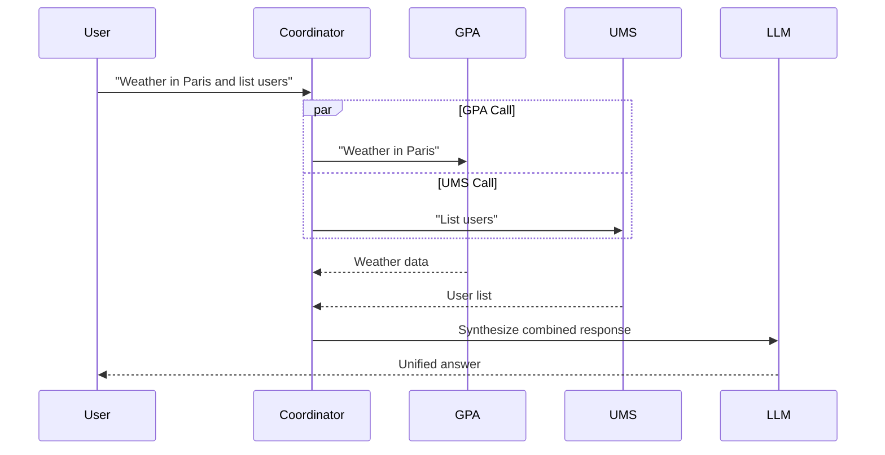
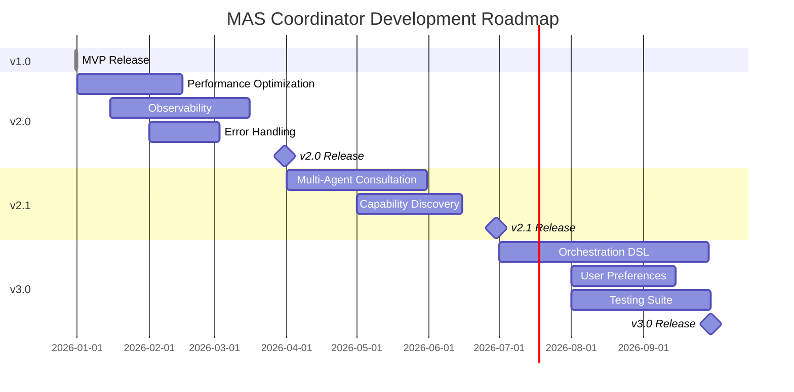

# Roadmap

Future development plans, milestones, and risk assessment for the MAS Coordinator project.

## Current Version: 1.0.0

**Status**: Production-ready MVP  
**Release Date**: 2025-12-31

### Features Implemented ✅
- Intelligent LLM-based routing between GPA and UMS agents
- Three-stage orchestration with real-time UI feedback
- Stage propagation from GPA to coordinator
- Attachment forwarding for images and documents
- State management for multi-turn conversations
- Streaming responses with SSE
- Docker Compose deployment with all dependencies

## Version 2.0.0 (Q1 2026)

**Theme**: Performance & Observability

### Planned Features

#### 1. Performance Optimization
**Priority**: High  
**Effort**: Medium

- [ ] Implement coordination decision caching
  - Cache routing decisions for similar queries
  - Redis-backed cache with TTL
  - Expected: 40% latency reduction for repeated patterns

- [ ] Parallel LLM calls optimization
  - Speculative agent execution (start likely agent immediately)
  - Cancel if routing decision differs
  - Expected: 1-2s latency improvement

- [ ] State compression
  - Prune old tool call history in GPA state
  - Keep only last N turns
  - Prevent Redis memory issues

#### 2. Observability & Monitoring
**Priority**: High  
**Effort**: High

- [ ] Structured logging with correlation IDs
  - OpenTelemetry integration
  - Trace routing decision → agent call → synthesis
  - Log sampling for high-volume scenarios

- [ ] Metrics collection
  - Prometheus metrics endpoint
  - Track: routing accuracy, latency per stage, agent error rates
  - Grafana dashboards

- [ ] Health checks per component
  - `/health` endpoint with dependency checks
  - Verify: DIAL Core, GPA, UMS, Redis connectivity
  - Kubernetes readiness/liveness probes

#### 3. Error Handling Improvements
**Priority**: Medium  
**Effort**: Low

- [ ] Retry logic with exponential backoff
  - Retry agent calls on transient failures
  - Circuit breaker pattern for unhealthy agents

- [ ] Fallback strategies
  - If coordination LLM fails → default to GPA
  - If agent fails → return helpful error message
  - If synthesis fails → return raw agent output

## Version 2.1.0 (Q2 2026)

**Theme**: Multi-Agent Capabilities

### Planned Features

#### 1. Multi-Agent Consultation
**Priority**: Medium  
**Effort**: High

- [ ] Parallel agent execution
  - Call multiple agents simultaneously
  - Synthesize combined responses
  - Use case: "Search web AND check users"



#### 2. Agent Capability Discovery
**Priority**: Low  
**Effort**: Medium

- [ ] Dynamic agent registration
  - Agents publish capabilities via `/capabilities` endpoint
  - Coordinator queries capabilities on startup
  - Routing based on advertised skills

- [ ] Capability-based routing
  - LLM decides based on agent capabilities, not hardcoded names
  - Easier to add new agents without code changes

#### 3. Conversation Context Sharing
**Priority**: Low  
**Effort**: High

- [ ] Cross-agent context
  - Share relevant information between GPA and UMS
  - Example: User asks about weather (GPA), then "create user in that city" (UMS)
  - UMS can reference "Paris" from GPA context

## Version 3.0.0 (Q3 2026)

**Theme**: Advanced Features & Extensibility

### Planned Features

#### 1. Agent Orchestration DSL
**Priority**: Low  
**Effort**: Very High

- [ ] YAML-based orchestration configuration
```yaml
agents:
  - name: GPA
    endpoint: http://localhost:8052
    capabilities: [web_search, code_execution, rag]
    priority: 1
  - name: UMS
    endpoint: http://localhost:8042
    capabilities: [user_management]
    priority: 1
  - name: NewAgent
    endpoint: http://localhost:9000
    capabilities: [custom_capability]
    priority: 2

routing:
  rules:
    - if: contains(query, "user")
      then: UMS
    - if: contains(query, "weather")
      then: GPA
  default: GPA
```

#### 2. User Preferences
**Priority**: Medium  
**Effort**: Medium

- [ ] Per-user settings
  - Skip synthesis (power users)
  - Preferred agents
  - Verbosity level (stages on/off)

- [ ] Stored in Redis keyed by user ID

#### 3. Testing & Quality Assurance
**Priority**: High  
**Effort**: Medium

- [ ] Unit test suite with pytest
  - 80%+ coverage target
  - Test models, utilities, prompts

- [ ] Integration test suite
  - Docker Compose-based test environment
  - Test actual GPA/UMS interactions

- [ ] Load testing
  - Apache Bench / Locust
  - Target: 100 req/s with p99 < 15s

## Backlog (Unscheduled)

### Features Under Consideration

- **Agent Result Validation**: LLM validates agent output before synthesis
- **Cost Optimization**: Smaller model for coordination, GPT-4o only for synthesis
- **Multi-language Support**: I18n for stage names and system prompts
- **Conversation Branching**: Support "what if" scenarios without polluting history
- **Agent A/B Testing**: Route fraction of traffic to experimental agents
- **Audit Logging**: Immutable log of all routing decisions and agent calls

## Risk Register

### High Priority Risks

| Risk | Impact | Probability | Mitigation |
|------|--------|------------|------------|
| **LLM Routing Failures** | High | Medium | Fallback to default agent (GPA), retry logic |
| **Agent Downtime** | High | Low | Health checks, circuit breakers, error messages |
| **State Storage Overflow** | Medium | Medium | State compression, TTL policies, monitoring |
| **API Key Exposure** | Very High | Low | Secrets manager, pre-commit hooks, documentation |
| **Breaking DIAL SDK Changes** | Medium | Low | Pin SDK versions, test upgrades in staging |

### Medium Priority Risks

| Risk | Impact | Probability | Mitigation |
|------|--------|------------|------------|
| **Latency Creep** | Medium | Medium | Performance monitoring, optimization roadmap |
| **Redis Memory Exhaustion** | Medium | Medium | Eviction policies, memory limits, alerting |
| **Network Partition** | Medium | Low | Retry logic, timeouts, status monitoring |
| **Incompatible Agent Updates** | Low | Medium | Gateway abstraction, integration tests |

## Milestones



## Feature Requests

To submit a feature request:
1. Check existing issues/requests
2. Open GitHub issue with label `feature-request`
3. Include: problem statement, proposed solution, use case
4. Team reviews quarterly for roadmap inclusion

**TODO**: Add link to issue tracker

## Version History

| Version | Release Date | Highlights |
|---------|-------------|------------|
| 1.0.0 | 2025-12-31 | Initial MVP release |

## Open Questions

1. **Multi-tenant Support**: How to isolate conversations per organization?
2. **Agent Authentication**: Should agents verify coordinator identity?
3. **Rate Limiting**: Per-user? Per-agent? Both?
4. **Conversation Export**: Format for backing up conversations?
5. **GDPR Compliance**: How to handle user data deletion requests?

## Related Documents

- [Architecture](architecture.md) - Current system design
- [ADR Index](adr/README.md) - Architecture decisions
- [Testing Guide](testing.md) - Test strategy

---

**Last Updated**: 2025-12-31  
**Product Owner**: TODO: Add contact  
**Roadmap Review**: Quarterly
