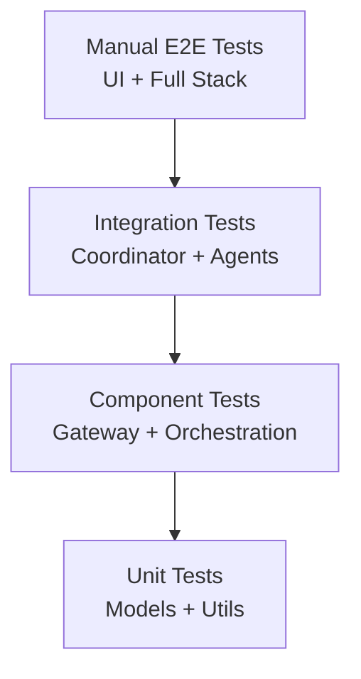

# Testing Guide

Comprehensive testing strategy and procedures for the MAS Coordinator project.

## Table of Contents
- [Test Strategy](#test-strategy)
- [Manual Testing](#manual-testing)
- [Integration Testing](#integration-testing)
- [Performance Testing](#performance-testing)
- [Test Scenarios](#test-scenarios)
- [Debugging](#debugging)

## Test Strategy

### Testing Pyramid



### Current Test Coverage

| Layer | Status | Priority |
|-------|--------|----------|
| Unit Tests | ⚠️ TODO | High |
| Component Tests | ⚠️ TODO | High |
| Integration Tests | ✅ Manual | Medium |
| E2E Tests | ✅ Manual | Low |

### Test Types

1. **Manual Integration Tests**: Verify end-to-end flows via cURL/UI
2. **Component Tests**: Test individual gateways and coordinator logic
3. **Unit Tests**: Test models, utilities, prompt formatting
4. **Performance Tests**: Measure latency and throughput

## Manual Testing

### Prerequisites

Ensure all services are running:
```bash
docker-compose ps  # All services should be "Up"
python -m uvicorn task.app:app --port 8055 --host 0.0.0.0
```

### Test Suite 1: Basic Functionality

#### Test 1.1: Health Check

**Objective**: Verify coordinator is reachable.

```bash
curl -X POST http://localhost:8055/openai/deployments/mas-coordinator/chat/completions \
  -H "Content-Type: application/json" \
  -H "Api-Key: dial_api_key" \
  -d '{
    "messages": [{"role": "user", "content": "Hello"}],
    "stream": false
  }'
```

**Expected**:
- Status: 200 OK
- Response contains `"role": "assistant"`
- Content is a friendly greeting

#### Test 1.2: Streaming Response

```bash
curl -N -X POST http://localhost:8055/openai/deployments/mas-coordinator/chat/completions \
  -H "Content-Type: application/json" \
  -H "Api-Key: dial_api_key" \
  -d '{
    "messages": [{"role": "user", "content": "Tell me a short story"}],
    "stream": true
  }'
```

**Expected**:
- Incremental `data:` chunks
- Stage updates visible in deltas
- Ends with `data: [DONE]`

### Test Suite 2: GPA Routing

#### Test 2.1: Web Search

**Objective**: Verify routing to GPA for web search tasks.

```bash
curl -X POST http://localhost:8055/openai/deployments/mas-coordinator/chat/completions \
  -H "Content-Type: application/json" \
  -H "Api-Key: dial_api_key" \
  -d '{
    "messages": [{"role": "user", "content": "What is the current weather in Tokyo?"}],
    "stream": false
  }'
```

**Expected**:
- Coordination stage routes to **GPA**
- GPA agent stage appears
- Response includes weather information from web search
- State contains `"is_gpa": true`

#### Test 2.2: Python Code Execution

```bash
curl -X POST http://localhost:8055/openai/deployments/mas-coordinator/chat/completions \
  -H "Content-Type: application/json" \
  -H "Api-Key: dial_api_key" \
  -d '{
    "messages": [{"role": "user", "content": "Calculate the first 10 Fibonacci numbers"}],
    "stream": false
  }'
```

**Expected**:
- Routes to GPA
- Python interpreter MCP tool used
- Response includes Fibonacci sequence
- No execution errors

#### Test 2.3: RAG with Document

**Setup**: Upload a PDF document via DIAL Chat UI.

```bash
curl -X POST http://localhost:8055/openai/deployments/mas-coordinator/chat/completions \
  -H "Content-Type: application/json" \
  -H "Api-Key: dial_api_key" \
  -d '{
    "messages": [{
      "role": "user",
      "content": "Summarize this document",
      "custom_content": {
        "attachments": [{
          "type": "application/pdf",
          "url": "data:application/pdf;base64,JVBERi0xLj..."
        }]
      }
    }]
  }'
```

**Expected**:
- Routes to GPA
- Document processed by RAG
- Summary returned

#### Test 2.4: Image Generation

```bash
curl -X POST http://localhost:8055/openai/deployments/mas-coordinator/chat/completions \
  -H "Content-Type: application/json" \
  -H "Api-Key: dial_api_key" \
  -d '{
    "messages": [{"role": "user", "content": "Generate an image of a sunset over mountains"}],
    "stream": false
  }'
```

**Expected**:
- Routes to GPA
- DALL-E model used
- Response includes image attachment
- Image is base64-encoded PNG/JPEG

### Test Suite 3: UMS Routing

#### Test 3.1: List Users

```bash
curl -X POST http://localhost:8055/openai/deployments/mas-coordinator/chat/completions \
  -H "Content-Type: application/json" \
  -H "Api-Key: dial_api_key" \
  -d '{
    "messages": [{"role": "user", "content": "List all users"}],
    "stream": false
  }'
```

**Expected**:
- Coordination stage routes to **UMS**
- Response contains user list
- State contains `"ums_conversation_id"`

#### Test 3.2: Search Users

```bash
curl -X POST http://localhost:8055/openai/deployments/mas-coordinator/chat/completions \
  -H "Content-Type: application/json" \
  -H "Api-Key: dial_api_key" \
  -d '{
    "messages": [{"role": "user", "content": "Find users named John"}],
    "stream": false
  }'
```

**Expected**:
- Routes to UMS
- Filtered user list returned
- Correct UMS conversation state

#### Test 3.3: Create User

```bash
curl -X POST http://localhost:8055/openai/deployments/mas-coordinator/chat/completions \
  -H "Content-Type: application/json" \
  -H "Api-Key: dial_api_key" \
  -d '{
    "messages": [{"role": "user", "content": "Create a new user: Alice Johnson, email alice@example.com"}],
    "stream": false
  }'
```

**Expected**:
- Routes to UMS
- User created successfully
- Confirmation with user ID

#### Test 3.4: Multi-turn Conversation

**Request 1:**
```bash
curl -X POST http://localhost:8055/openai/deployments/mas-coordinator/chat/completions \
  -H "Content-Type: application/json" \
  -H "Api-Key: dial_api_key" \
  -H "x-conversation-id: test-conv-123" \
  -d '{
    "messages": [{"role": "user", "content": "List users"}]
  }' > response1.json
```

**Request 2** (using state from response1):
```bash
# Extract state from response1.json and include in next request
curl -X POST http://localhost:8055/openai/deployments/mas-coordinator/chat/completions \
  -H "Content-Type: application/json" \
  -H "Api-Key: dial_api_key" \
  -H "x-conversation-id: test-conv-123" \
  -d '{
    "messages": [
      {"role": "user", "content": "List users"},
      {
        "role": "assistant",
        "content": "...",
        "custom_content": {"state": {"ums_conversation_id": "..."}}
      },
      {"role": "user", "content": "Delete the first user"}
    ]
  }'
```

**Expected**:
- Same UMS conversation ID reused
- Context maintained across turns
- User deletion successful

### Test Suite 4: Edge Cases

#### Test 4.1: Ambiguous Request

```bash
curl -X POST http://localhost:8055/openai/deployments/mas-coordinator/chat/completions \
  -H "Content-Type: application/json" \
  -H "Api-Key: dial_api_key" \
  -d '{
    "messages": [{"role": "user", "content": "Tell me about John"}],
    "stream": false
  }'
```

**Expected**:
- LLM makes routing decision (likely GPA for general query)
- Response is coherent
- No routing errors

#### Test 4.2: Empty Message

```bash
curl -X POST http://localhost:8055/openai/deployments/mas-coordinator/chat/completions \
  -H "Content-Type: application/json" \
  -H "Api-Key: dial_api_key" \
  -d '{
    "messages": [{"role": "user", "content": ""}],
    "stream": false
  }'
```

**Expected**:
- 400 Bad Request OR polite error message
- No server crash

#### Test 4.3: Invalid API Key

```bash
curl -X POST http://localhost:8055/openai/deployments/mas-coordinator/chat/completions \
  -H "Content-Type: application/json" \
  -H "Api-Key: invalid_key" \
  -d '{
    "messages": [{"role": "user", "content": "Hello"}]
  }'
```

**Expected**:
- 401 Unauthorized
- Error message about invalid API key

#### Test 4.4: Very Long Message

```bash
curl -X POST http://localhost:8055/openai/deployments/mas-coordinator/chat/completions \
  -H "Content-Type: application/json" \
  -H "Api-Key: dial_api_key" \
  -d '{
    "messages": [{"role": "user", "content": "'"$(python3 -c 'print("word " * 5000)')"'"}]
  }'
```

**Expected**:
- Handles gracefully (may truncate or return error)
- No timeout or crash

## Integration Testing

### Test Infrastructure Health

**Script**: `test_infrastructure.sh`
```bash
#!/bin/bash
set -e

echo "Testing DIAL Core..."
curl -f http://localhost:8080/health || exit 1

echo "Testing GPA Agent..."
curl -f http://localhost:8052/health || exit 1

echo "Testing UMS Agent..."
curl -f http://localhost:8042/health || exit 1

echo "Testing Redis..."
docker-compose exec -T redis redis-cli ping | grep -q PONG || exit 1

echo "✅ All infrastructure healthy"
```

### Integration Test: GPA Flow

```python
import asyncio
from aidial_client import AsyncDial

async def test_gpa_flow():
    client = AsyncDial(base_url="http://localhost:8055", api_version="2025-01-01-preview")
    
    response = await client.chat.completions.create(
        model="mas-coordinator",
        messages=[{"role": "user", "content": "What is 2+2?"}],
        stream=False,
        extra_headers={"Api-Key": "dial_api_key"}
    )
    
    content = response.choices[0].message.content
    assert "4" in content, f"Expected '4' in response, got: {content}"
    
    # Check state contains GPA marker
    state = response.choices[0].message.custom_content.state
    assert state.get("is_gpa") == True, "Expected GPA state marker"
    
    print("✅ GPA flow test passed")

asyncio.run(test_gpa_flow())
```

### Integration Test: UMS Flow

```python
import asyncio
from aidial_client import AsyncDial

async def test_ums_flow():
    client = AsyncDial(base_url="http://localhost:8055", api_version="2025-01-01-preview")
    
    response = await client.chat.completions.create(
        model="mas-coordinator",
        messages=[{"role": "user", "content": "List all users"}],
        stream=False,
        extra_headers={"Api-Key": "dial_api_key"}
    )
    
    content = response.choices[0].message.content
    assert "user" in content.lower(), f"Expected users in response: {content}"
    
    # Check state contains UMS conversation ID
    state = response.choices[0].message.custom_content.state
    assert "ums_conversation_id" in state, "Expected UMS conversation ID"
    
    print("✅ UMS flow test passed")

asyncio.run(test_ums_flow())
```

## Performance Testing

### Latency Benchmarks

**Test Script**: `benchmark_latency.py`
```python
import asyncio
import time
from aidial_client import AsyncDial

async def benchmark():
    client = AsyncDial(base_url="http://localhost:8055", api_version="2025-01-01-preview")
    
    tests = [
        ("GPA - Simple", "What is 2+2?"),
        ("GPA - Web Search", "What is the weather?"),
        ("UMS - List", "List users"),
    ]
    
    for name, query in tests:
        start = time.time()
        
        response = await client.chat.completions.create(
            model="mas-coordinator",
            messages=[{"role": "user", "content": query}],
            stream=False,
            extra_headers={"Api-Key": "dial_api_key"}
        )
        
        elapsed = time.time() - start
        print(f"{name}: {elapsed:.2f}s")

asyncio.run(benchmark())
```

**Expected Latency** (local environment):
- GPA Simple: < 3s
- GPA Web Search: < 8s
- UMS List: < 2s

### Streaming Performance

```python
import asyncio
import time
from aidial_client import AsyncDial

async def test_ttft():  # Time to First Token
    client = AsyncDial(base_url="http://localhost:8055", api_version="2025-01-01-preview")
    
    start = time.time()
    stream = await client.chat.completions.create(
        model="mas-coordinator",
        messages=[{"role": "user", "content": "Tell me a story"}],
        stream=True,
        extra_headers={"Api-Key": "dial_api_key"}
    )
    
    first_token_time = None
    async for chunk in stream:
        if chunk.choices and chunk.choices[0].delta.content:
            if first_token_time is None:
                first_token_time = time.time() - start
                print(f"⏱ TTFT: {first_token_time:.2f}s")
            break

asyncio.run(test_ttft())
```

**Expected TTFT**: < 2s

## Test Scenarios

### Scenario 1: New User Onboarding

**User Story**: User wants to add a new employee to the system.

**Steps**:
1. User: "Add a new user: Bob Smith, email bob@company.com, role: developer"
2. Verify UMS routing
3. Verify user created with correct details
4. User: "Show me Bob's details"
5. Verify same conversation context used
6. Verify Bob's information returned

### Scenario 2: Research Task

**User Story**: User needs to research a topic and create a report.

**Steps**:
1. User: "Search the web for recent AI breakthroughs"
2. Verify GPA routing
3. Verify web search results
4. User: "Create a Python script to analyze sentiment"
5. Verify Python interpreter used
6. Verify code executed successfully

### Scenario 3: Mixed Workflow

**User Story**: User switches between user management and general tasks.

**Steps**:
1. User: "List active users"
2. Verify UMS routing
3. User: "What's the weather in their city?" (ambiguous - needs context)
4. Verify appropriate routing
5. User: "Delete inactive users"
6. Verify UMS routing with correct conversation state

## Debugging

### Enable Debug Logging

```bash
export LOG_LEVEL="DEBUG"
python -m uvicorn task.app:app --port 8055 --log-level debug
```

### View Service Logs

```bash
# Coordinator logs
tail -f <coordinator-output>

# GPA Agent logs
docker-compose logs -f general-purpose-agent

# UMS Agent logs
docker-compose logs -f ums-agent

# DIAL Core logs
docker-compose logs -f core
```

### Inspect Redis State

```bash
# Connect to Redis
docker-compose exec redis redis-cli

# List all keys
KEYS *

# Get specific conversation state
GET dial:conversations:<conversation-id>
```

### Debug Stage Propagation

Add debug print in [task/coordination/gpa.py](../task/coordination/gpa.py):

```python
if delta.custom_content:
    print(f"[DEBUG] custom_content: {delta.custom_content.dict(exclude_none=True)}")
```

### Test LLM Prompts

Test coordination prompt directly:

```python
from aidial_client import AsyncDial
import json

client = AsyncDial(base_url="http://localhost:8080", api_version="2025-01-01-preview")

response = await client.chat.completions.create(
    model="gpt-4o",
    messages=[
        {"role": "system", "content": COORDINATION_REQUEST_SYSTEM_PROMPT},
        {"role": "user", "content": "List all users"}
    ],
    extra_body={
        "response_format": {
            "type": "json_schema",
            "json_schema": {
                "name": "response",
                "schema": CoordinationRequest.model_json_schema()
            }
        }
    }
)

print(json.loads(response.choices[0].message.content))
```

## Test Automation (TODO)

### Unit Tests with pytest

**TODO**: Implement unit tests for:
- `CoordinationRequest` model validation
- `StageProcessor` utilities
- Message preparation logic
- State extraction utilities

**Example**:
```python
# tests/test_models.py
from task.models import CoordinationRequest, AgentName

def test_coordination_request_validation():
    req = CoordinationRequest(agent_name=AgentName.GPA)
    assert req.agent_name == "GPA"
    assert req.additional_instructions is None

def test_coordination_request_with_instructions():
    req = CoordinationRequest(
        agent_name=AgentName.UMS,
        additional_instructions="Filter by active"
    )
    assert req.additional_instructions == "Filter by active"
```

### Component Tests

**TODO**: Test gateways in isolation with mocked agents.

### CI/CD Integration

**TODO**: Add GitHub Actions workflow:
```yaml
name: Tests
on: [push, pull_request]
jobs:
  test:
    runs-on: ubuntu-latest
    steps:
      - uses: actions/checkout@v3
      - uses: actions/setup-python@v4
        with:
          python-version: '3.12'
      - run: pip install -r requirements.txt
      - run: pytest tests/
```

---

**Related Documents**:
- [Setup Guide](setup.md) - Environment setup
- [API Reference](api.md) - Interface specs
- [Architecture](architecture.md) - System design
